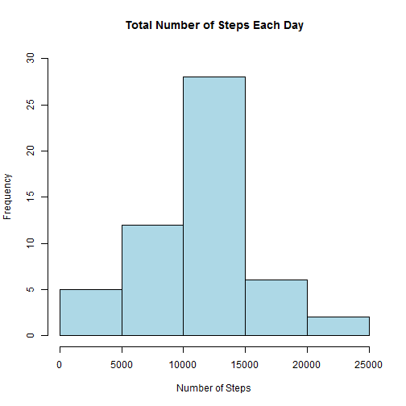
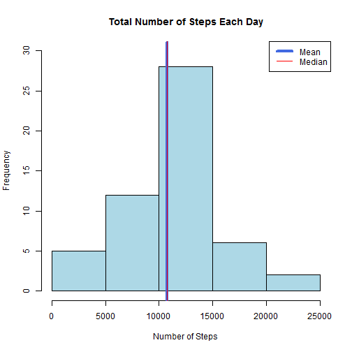
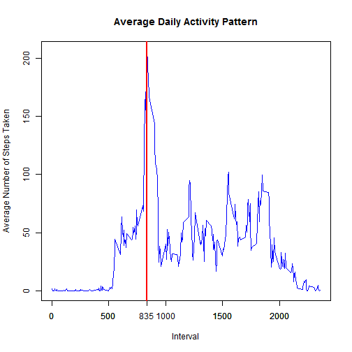
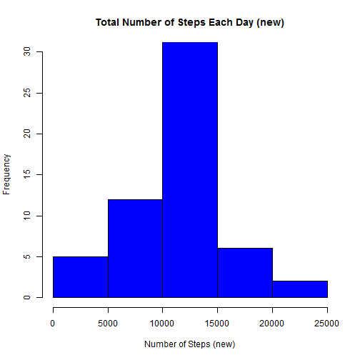
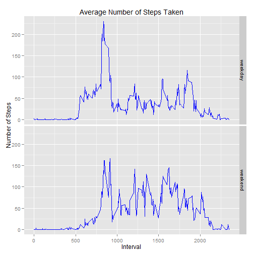

Reproducible Research Peer Assighnment 1
========================================================


```r
# set working directory
setwd("C:/Users/Josephine/Desktop/Reproducible Research/PA1")
# read csv file
activity <- read.csv("C:/Users/Josephine/Desktop/Reproducible Research/PA1/activity.csv")
# remove na in the dataset
narmact <- activity[complete.cases(activity),]
# load plyr package
library(plyr)
# smmarize sum of steps by date
stepsbyday <- ddply(narmact, "date", summarize, steps = sum (steps))
```

Below R codes and plot answer the 1st questions from assighnment: What is the average daily activity pattern?
1. Make a histogram of the total number of steps taken each day


```r
# creat a histgram showing the total number of steps taken each day
plot1 <- hist(stepsbyday$steps, main = "Total Number of Steps Each Day", col = "lightblue", xlab = "Number of Steps", ylim = c(0,30))
```

 

```r
# print out plot1
dev.copy(png, file = "plot1.png")
```

```
## png 
##   3
```

```r
dev.off()
```

```
## pdf 
##   2
```

2. Calculate and report the mean and median total number of steps taken per day and show them in the histogram
mean: 10766.19
median: 10765


```r
# calculate the mean
meanstepsbyday <- mean(stepsbyday$steps)
meanstepsbyday
```

```
## [1] 10766
```

```r
# calculate the mdian
medianstepsbyday <- median(stepsbyday$steps)
medianstepsbyday
```

```
## [1] 10765
```


```r
# create a histgram and add mean and median lines
plot2 <- hist(stepsbyday$steps, main = "Total Number of Steps Each Day", col = "lightblue", xlab = "Number of Steps", ylim = c(0,30))
abline(v = mean(stepsbyday$steps), col = "royalblue", lwd = 4)
abline(v = median(stepsbyday$steps), col = "red", lwd = 1)
legend(x = "topright", c( "Mean", "Median"), col = c("royalblue", "red"), lwd = c(4, 1))
```

 

```r
# print out plot2
dev.copy(png, file = "plot2.png")
```

```
## png 
##   3
```

```r
dev.off()
```

```
## pdf 
##   2
```


Below R codes and plot answer 2nd questions from assighnment: What is the average daily activity pattern?
1.Make a time series plot (i.e. type = "l") of the 5-minute interval (x-axis) and the average number of steps taken, averaged across all days (y-axis)
2.835 5-minute interval, on average across all the days in the dataset, contains the maximum number of steps


```r
# summarize mean steps by interval
stepsbyinterval <- ddply(narmact, "interval", summarize, steps = mean (steps))
```


```r
# create a time series plot
plot3 <- plot(stepsbyinterval$interval, stepsbyinterval$steps, type = "l", col = "blue", main = "Average Daily Activity Pattern", xlab = "Interval", ylab = "Average Number of Steps Taken") 
# calculate which interval has the max average steps
interval <- subset(stepsbyinterval, steps == max(steps), select = interval)
interval
```

```
##     interval
## 104      835
```

```r
# add tickmarks and vertical line on the finding
ticks <- c(0, 500, 835, 1000, 1500, 2000)
axis(side = 1, at = ticks)
abline(v = 835, col = "red", lwd = 2)
```

 

```r
# ptint out plot3
dev.copy(png, file = "plot3.png", width=1021, height=474)
```

```
## png 
##   3
```

```r
dev.off()
```

```
## pdf 
##   2
```

Below R codes and plot answer 3rd questions from the assighnment: Imputing missing values
1.Calculate and report the total number of missing values in the dataset (i.e. the total number of rows with NAs): 2304


```r
# count NAs
countnarow <- count(!complete.cases(activity))
countnarow
```

```
##       x  freq
## 1 FALSE 15264
## 2  TRUE  2304
```

2.Devise a strategy for filling in all of the missing values in the dataset.
mean for the 5-minute interval is used to fill in all the missing values.


```r
# subset NA data
naact <- activity[!complete.cases(activity), -1]
# merge NA data with dataset with mean by interval
dfMerge<- merge(naact,stepsbyinterval,by="interval", all.x=TRUE)
# reorder columns
dfMerge<- dfMerge[,c(3,2,1)]
```

3.Create a new dataset that is equal to the original dataset but with the missing data filled in.


```r
# rbind NA removed dataset with NA filled dataset
newdat <- rbind(narmact,dfMerge)
```

4.Make a histogram of the total number of steps taken each day and Calculate and report the mean and median total number of steps taken per day. These values differ slightly from the estimates from the first part of the assignment. What is the impact of imputing missing data on the estimates of the total daily number of steps?
Mean: 10766.19
Median: 10766.19
The strategy used to impute the missing data on the estimates of the total daily number of steps has small impacts.
The new mean is the same as previous dataset without NA steps. The Median increasd by 1.19


```r
newstepsbyday <- ddply(newdat, "date", summarize, steps = sum (steps))
```


```r
# calculate the new mean
newmeanstepsbyday <- mean(newstepsbyday$steps)
newmeanstepsbyday
```

```
## [1] 10766
```

```r
# calculate the new mdian
newmedianstepsbyday <- median(newstepsbyday$steps)
newmedianstepsbyday
```

```
## [1] 10766
```


```r
# create a new histgram
plot4 <- hist(newstepsbyday$steps, main = "Total Number of Steps Each Day (new)", col = "blue", xlab = "Number of Steps (new)", ylim = c(0,30))
```

 

```r
dev.copy(png, file = "plot4.png")
```

```
## png 
##   3
```

```r
dev.off()
```

```
## pdf 
##   2
```

Below R codes and plot answer 3rd questions from the assighnment: Are there differences in activity patterns between weekdays and weekends?
1.Create a new factor variable in the dataset with two levels ¨C ¡°weekday¡± and ¡°weekend¡± indicating whether a given date is a weekday or weekend day.


```r
# set system language to English
Sys.setlocale("LC_TIME", "English") 
```

```
## [1] "English_United States.1252"
```

```r
# turn dates into weekdays
newdat$date <- weekdays(as.Date(newdat$date))
# add one colmun indicating if the day is weekday or weekend
newdatwk<- transform(newdat, week = ifelse(date %in% c("Saturday", "Sunday"), "weekend", "weekday"))
```

2.Make a panel plot containing a time series plot (i.e. type = "l") of the 5-minute interval (x-axis) and the average number of steps taken, averaged across all weekday days or weekend days (y-axis)


```r
# summarize mean of steps by interval and weekday/weekend.
newstepsbyinterval <- ddply(newdatwk, c("interval", "week"), summarize, steps = mean (steps))
# load ggplot2 package
library(ggplot2)
# create a panelplot showing weekday and weekend 5-minute interval and the average number of steps taken
g <- ggplot(newstepsbyinterval, aes(interval, steps))
plot5 <- g + geom_line(color = "Blue") + labs(x = "Interval") + labs(y = "Number of Steps") + labs(title = "Average Number of Steps Taken") + facet_grid(week~ .)
plot5
```

 

```r
# print out plot5
dev.copy(png, file = "plot5.png")
```

```
## png 
##   3
```

```r
dev.off()
```

```
## pdf 
##   2
```

